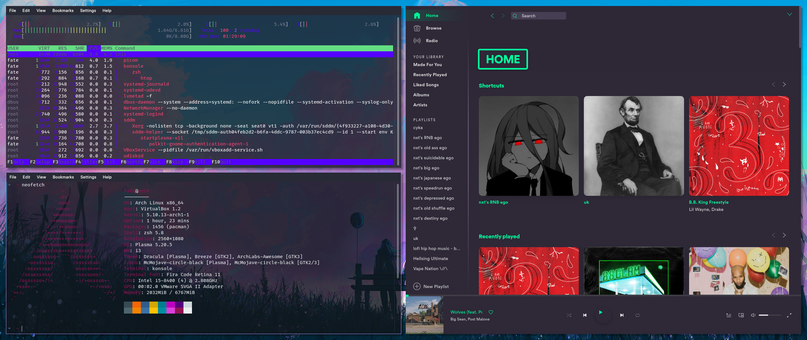
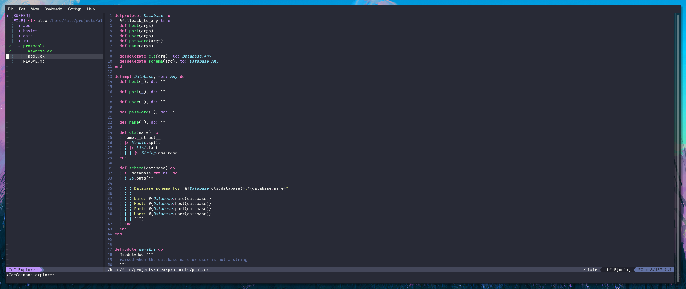
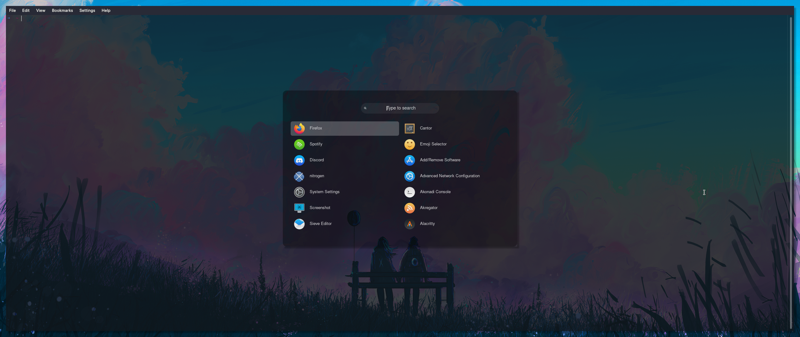
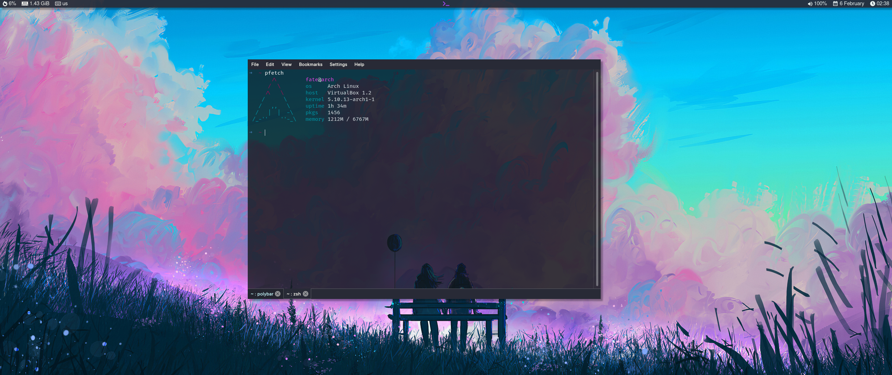

### My dotfiles/config for my Arch distro

### Arch specs

* CPU - Intel i5 8400, 4 Cores
* GPU - Asus Nvidia RTX 2060
* RAM - 16GB 2x8
* Motherboard - Asus H310 Prime
* 1x nvme M.2 480GB, 1x SSD 1TB, 1x HDD Blue 1TB
* Mouse - Razer Death adder
* Custom

### Tools

* Window Manager - i3
* Desktop Enviroment - Plasma
* Theme - Dracula
* Status Bar - polybar
* Terminal Font - [Fira Code](https://github.com/ryanoasis/nerd-fonts/tree/master/patched-fonts/FiraCode)
* System Font - [San-Francisco / MacOS Font](https://aur.archlinux.org/packages/otf-san-francisco/)
* Compositor - Picom
* Terminal - **Main** Konsole / alacrity
* Application launcher - Rofi
* File Manager - Dolphin
* Shell - oh-my-zsh
* Background setter - feh

### Apps

* MusicPlayer - ncmpcpp / Spicetify
* Editor - Neovim
* WebBrowser - Firefox

### Credits 

* Polybar config - [Sad-Soul-Eater](https://github.com/Sad-Soul-Eater)
* Picom / i3 config - [WillPower3309](https://github.com/WillPower3309)
